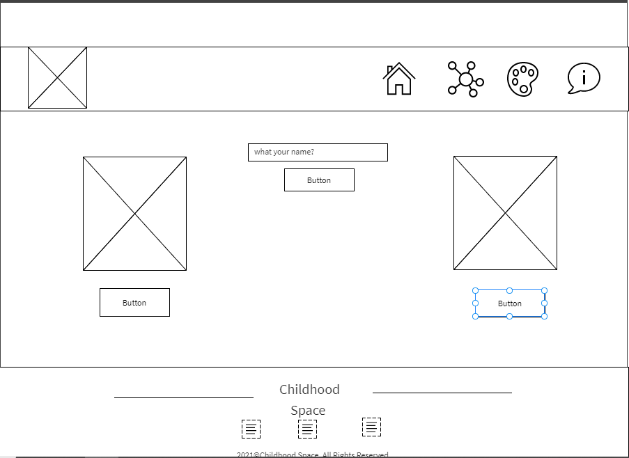
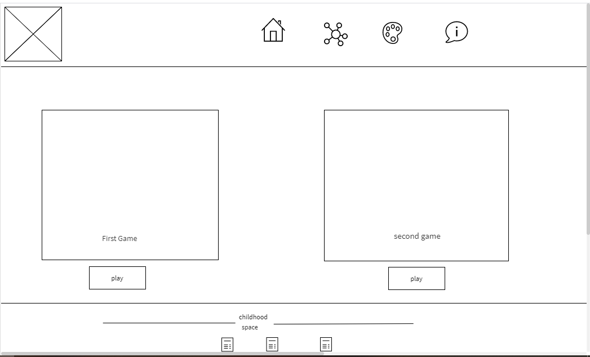
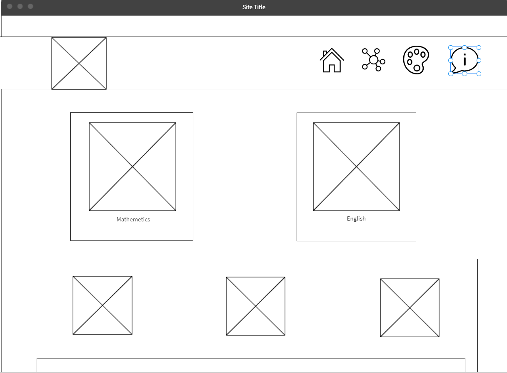

# Childhood-Space

Childhood Space it is a place which children can learn & have fun at same time.

**Thursday Feb 25** : We suggest a lot of ideas for this project , every one have his idea then we voting to the best . It was *Childhood Space* , After that we decide what features that will be in our website : 
- **Learning** : The child can learn and playing simple games to learn.
  - Math Learning
  - English Learning
- **Games** : The child can play games and learning to concentration and mind Blowing
  - Memory Game
  - Shapes Game

**Weekend** :
- *Sara* did Home page and style it .
- *Mohammad & Anagheem* did Memory game .
- *Khalid & Malak* Nothing

**Sunday Feb 28** , Today is the hardest day So :
- *Sara* add some images and form to home page , edit some styling , help anagheem to style memory game.
- *Mohammad & Anagheem* add levels to memory game.
- *Khalid & Malak* start work with learning page ,add:
  - learning option : Math or English
  - Math lessons Option : Numbers Lesson, Addition lesson or Substraction lesson

**Monday Mar 1** :
- *Sara* : Edit home page , add background , add popup message , work in contact us page and add some styling.
- *Mohammad* : help Anaghemm & Khalid to edit memory game. add color lesson with Malak.
- *Malak* : add Number & substraction lesson , work with mohammad to add English learning , add colors lesson & Sense lessson.
- *Anagheem* : work with khaled to edit Memory game , and trying to make shapes game.
- *Khalid* : work with Anagheem to edit Memory game

Wireframes :

userStories :
- As Mia , I want to learn Math So I can have high marks in school.
- As Ryan , I want to have fun when I'm learning English
- As Mom , I want to find easy way to learn my child
- As Dad , I want to increase my children growth mindset by catching the memory game
- as ali, I want to find that's help me to know the shapes name in english So I can solve math exam.

Group Members :
- Malak Al-momani (leader)
- Khaled Bassam
- Sara Altaweel 
- Mohammad Alkhazali

- Anagheem Bayan 

201 Final Project
